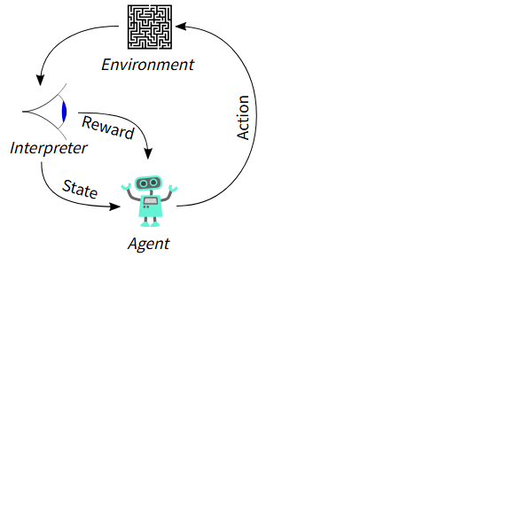
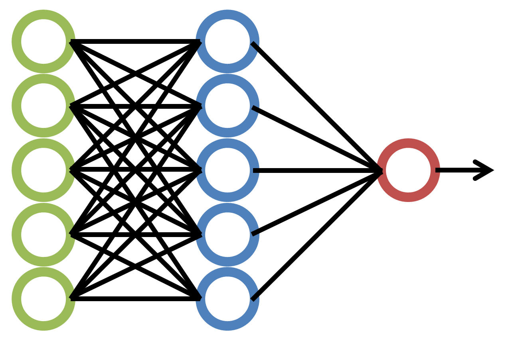
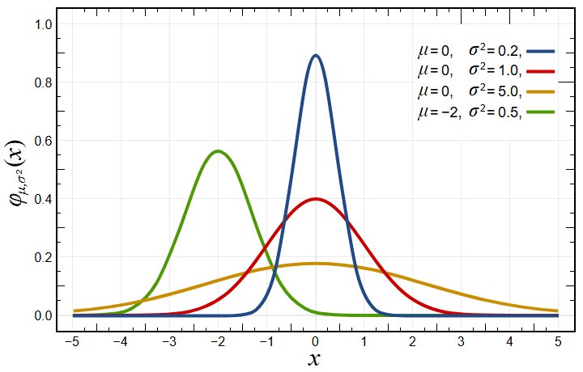

# G検定入門 — AI・ディープラーニング基礎からの合格ガイド

- 対象読者: AI・ディープラーニング未経験者〜中級者（ビジネスパーソン向け）
- レベル: 初級〜中級
- 想定学習時間: 30〜50時間
- 対応: シラバスG2024準拠（2026年試験対応）
- 作成日: 2026年7月31日

## 目次

1. [はじめに](#はじめに)
2. [第1章 人工知能とは](#第1章-人工知能とは)
3. [第2章 人工知能をめぐる動向](#第2章-人工知能をめぐる動向)
4. [第3章 機械学習の基礎](#第3章-機械学習の基礎)
5. [第4章 ディープラーニングの概要](#第4章-ディープラーニングの概要)
6. [第5章 ディープラーニングの要素技術と応用例](#第5章-ディープラーニングの要素技術と応用例)
7. [第6章 AIの社会実装](#第6章-aiの社会実装)
8. [第7章 AIに必要な数理・統計](#第7章-aiに必要な数理統計)
9. [第8章 AIに関する法律と契約](#第8章-aiに関する法律と契約)
10. [第9章 AI倫理・AIガバナンス](#第9章-ai倫理aiガバナンス)
11. [第10章 総まとめと合格戦略](#第10章-総まとめと合格戦略)
12. [付録A 練習問題の解答](#付録a-練習問題の解答)
13. [付録B 用語集](#付録b-用語集)
14. [付録C 資格対応（正解率と合格目安）](#付録c-資格対応正解率と合格目安)

---

## はじめに

### 学習目標

- G検定の試験概要（形式・時間・合格目安）を説明できる
- 本書の使い方と学習の進め方を理解する

### G検定とは

**G検定（JDLA Deep Learning for GENERAL）** は、一般社団法人日本ディープラーニング協会（JDLA）が実施する、AI・ディープラーニングの**活用リテラシー**を認定する検定試験です。エンジニアだけでなく、営業・企画・マーケティング・総務など、幅広いビジネスパーソンが受験対象です。

G検定で問われるのは「AIで何ができて、何ができないのか」「どこにAIを活用すればよいか」「AIを活用するためには何が必要か」という視点です。技術の実装能力ではなく、**AIを事業に活用するための知識と判断力**が評価されます。

### 試験概要（2026年時点）

| 項目 | 内容 |
|---|---|
| 主催 | 一般社団法人日本ディープラーニング協会（JDLA） |
| 形式 | 知識問題（多肢選択式）、145問程度 |
| 試験時間 | オンライン試験100分 / 会場試験120分 |
| 受験料 | 一般13,200円 / 学生5,500円（税込） |
| 受験資格 | 制限なし |
| 合格ライン | 非公表。受験者の体験談等から**正答率70%程度**が目安とされる[1] |
| 特徴 | オープンブック形式（資料参照可。オンライン試験のみ）[1] |

*出典: JDLA公式サイト「G検定とは」[1]*

### 本書の使い方

1. 第1章〜第2章でAI・ディープラーニングの全体像と歴史を学ぶ
2. 第3章〜第5章で機械学習・ディープラーニングの仕組みを学ぶ
3. 第6章〜第9章で社会実装・数理統計・法律・倫理を学ぶ
4. 第10章で総復習し、各章末の練習問題、付録Aの解答解説と付録Bの用語集で仕上げる

各章の冒頭に「学習目標」、章末に「本章のまとめ」と「練習問題」があります。練習問題は解答解説を付録Aに収録しています。

### 本章のまとめ

- G検定はAI・ディープラーニングの**活用リテラシー**を認定する資格である
- 形式は多肢選択式145問程度、合格目安は正答率70%程度
- 資格の有効期限はない

### 練習問題

**練習問題 0.1** G検定で評価されるものとして最も適切なものはどれか。

1. ディープラーニングモデルを実装するエンジニアリング能力
2. AI・ディープラーニングをビジネスで活用するための知識と判断力
3. AIに関する最新論文を執筆する研究能力
4. 大規模なGPUクラスタを運用するインフラ能力

**練習問題 0.2** 2026年時点のG検定の試験形式として正しいものはどれか。

1. 記述式試験で、100分間に3問を解答する
2. 多肢選択式で、オンライン試験は100分・145問程度
3. 口述試験で、面接官と対話する
4. 実技試験で、モデルを実際に学習させる

---

## 第1章 人工知能とは

### 学習目標

- 人工知能（AI）の定義と分類を説明できる
- AI効果の意味を説明できる
- 人工知能とロボットの違いを説明できる
- 人工知能分野で議論される代表的な問題を説明できる

### 人工知能の定義

**人工知能（AI: Artificial Intelligence）** に唯一の定義はありませんが、一般的には「**人間の知的活動をコンピュータで実現する技術やシステム**」と理解されています。


*画像出典: Wikimedia Commons「DALL-E 3 - advanced artificial intelligence.png」（AI生成画像・パブリックドメイン）。*

JIS（日本産業規格、JIS X 0028:1999）では、人工知能は「**推論・学習などの知能的な機能を遂行するモデル及びシステムを取り扱う学際分野**」などと定義されています。

人工知能はその実現方法によって次の4段階に分類されます。

| レベル | 名称 | 例 |
|---|---|---|
| 1 | 単純な制御プログラム | 家電のタイマー、自動販売機 |
| 2 | 古典的な人工知能 | 将棋のプログラム、エキスパートシステム |
| 3 | 機械学習 | 迷惑メール判定、レコメンド |
| 4 | 深層学習（ディープラーニング） | 画像認識、音声認識、生成AI |

### AI効果

**AI効果**とは、人工知能によって実現された技術が普及すると、人々が「それは知能ではなく、ただの自動計算だ」とみなすようになる現象のことです。

例えば、電卓はかつて「人間の知能を代替する装置」と見なされましたが、今では誰も「電卓はAIだ」とは呼びません。チェスのプログラムも同様です。このように「知能かどうか」の判断は時代とともに移り変わります。

### 人工知能とロボットの違い

- **ロボット**: 物理的な身体（センサやアクチュエータ）を持ち、実世界で動作する機械
- **人工知能**: 必ずしも身体を持たない、知的な情報処理の仕組み

ロボットは「身体」、AIは「頭脳」に相当すると考えると分かりやすいです。両者は組み合わされることが多いですが、概念としては別物です。


*画像出典: NASA（米国連邦政府の職務著作物・パブリックドメイン）。Wikimedia Commons「Robonaut 2 working.jpg」より。*

### 人工知能分野で議論される問題

#### シンギュラリティ（技術的特異点）

**シンギュラリティ**とは、AIが人間の知能を超え、それ以降の未来を予測できなくなるという仮説です。数学者のジョン・フォン・ノイマンや作家のヴァーナー・ヴィンジらが提唱し、レイ・カーツワイルは「2045年に到来する」と予測しました。賛否両論ある仮説であり、実現可能性は議論の対象です。

#### 強いAIと弱いAI

- **強いAI（汎用人工知能・AGI）**: 人間と同等以上の知的活動をあらゆる分野で行えるAI。実現はしていない
- **弱いAI（特化型AI）**: 特定のタスクのみを処理するAI。現在のAIのほとんどはこちら

#### チューリングテスト

**チューリングテスト**は、アラン・チューリングが1950年に提案した「AIが知能を持つか」を判定するテストです。審査者が人間とAIを会話で区別できなければ、そのAIは「知能を持つ」とみなされます。ただし、単なる応答の模倣を判定するため、真の知能の判定としては批判もあります。

#### 中国語の部屋

哲学者ジョン・サールの思考実験です。英語が分からない人を密閉された部屋に入れ、中国語の質問にマニュアル通りに処理させて回答させます。外から見ると中国語を理解しているように見えるが、実際には理解していません。これは「記号操作を行っても意味理解にはならない」という反論で、チューリングテストの限界を示します。

#### シンボルグラウンディング問題

**シンボルグラウンディング問題**とは、コンピュータが扱う記号（シンボル）に、どのようにして実世界の意味（グラウンディング）を結びつけるか、という問題です。AIが言葉や概念を「本当に理解している」状態を作り出せるのかという根本的な問いです。

#### フレーム問題

**フレーム問題**とは、AIが「変化したもの」と「変化していないもの」をすべて考慮することは計算上不可能である、という問題です。現実世界では無限の情報があり、そのすべてを扱うことはできません。

#### 知識獲得のボトルネック

エキスパートシステムの時代に顕在化した問題で、専門家の暗黙知をルール化するのが難しいという問題です。「人間が当たり前に行っている判断」を形式化するのは困難です。

#### 身体性

**身体性**とは、知能は身体を持った存在と環境との相互作用によって生まれる、という考え方です。記号処理だけでは知能は実現できないという主張と結びついています。

#### トイ・プロブレム

**トイ・プロブレム（玩具の問題）** とは、チェスや迷路など単純化された問題のことです。これらは研究初期の成果を測るために使われましたが、現実の問題とはかけ離れているという批判もあります。

### 本章のまとめ

- 人工知能は「人間の知的活動をコンピュータで実現する技術」であり、制御プログラム→古典的AI→機械学習→深層学習の4段階に分類される
- AI効果により、普及した技術は「AIではない」とみなされる傾向がある
- シンギュラリティ、強いAI/弱いAI、チューリングテスト、中国語の部屋、シンボルグラウンディング問題、フレーム問題などが主要な議論テーマである

### 練習問題

**練習問題 1.1** AI効果の説明として最も適切なものはどれか。

1. AIを使うほど誤差が減り、効果が上がること
2. AIで実現した技術が普及すると、人々がそれを知能ではなく単なる計算とみなすこと
3. AIの計算速度が年々倍増すること
4. AIが人間の知能を超えた瞬間のこと

**練習問題 1.2** 現在のAIのほとんどに該当する分類として最も適切なものはどれか。

1. 強いAI（汎用人工知能）
2. 弱いAI（特化型AI）
3. シンギュラリティを迎えたAI
4. 身体性を持つAI

**練習問題 1.3** ロボットと人工知能の違いについて正しいものはどれか。

1. ロボットは知能を持ち、人工知能は身体を持つ
2. 人工知能は物理的な身体を持たず、ロボットは身体を持つ
3. ロボットと人工知能は完全に同じ概念である
4. ロボットは人工知能の一種であり、必ずAIを内蔵している

---

## 第2章 人工知能をめぐる動向

### 学習目標

- AIの歴史を3次ブームの流れで説明できる
- 探索・推論、知識表現とエキスパートシステムの概要を説明できる
- 機械学習とディープラーニングの違いを説明できる

### 第1次AIブーム（1950年代〜1960年代）: 探索・推論

**ダートマス会議（1956年）** で「Artificial Intelligence」という言葉が生まれました[2]。第1次ブームの中心は**探索・推論**で、迷路の探索や定理の証明、チェスなどのゲームを扱いました。

代表的な成果として、将棋・チェスのプログラムや、**ニューラルネットワーク（パーセプトロン）** の提案（ローゼンブラット、1958年）があります。しかし、複雑な現実問題を扱えない「トイ・プロブレム」の限界や、当時の計算機能力の低さからブームは衰退しました（第1次冬の時代）。

### 第2次AIブーム（1970年代後半〜1980年代）: 知識表現とエキスパートシステム

第2次ブームの中心は**知識表現**と**エキスパートシステム**でした。専門家の知識をルール（if-then形式）で表現し、推論エンジンで引き出すというアプローチです。

代表例:

- **エキスパートシステム**: 医療診断システム「MYCIN」など
- **知識表現**: 意味ネットワーク、オントロジー、フレーム
- **知識獲得のボトルネック**: 専門家の暗黙知をルール化する難しさ

しかし、専門家の知識をすべてルール化することが困難なこと（知識獲得のボトルネック）から、第2次ブームも衰退しました。

### 第3次AIブーム（2000年代〜現在）: 機械学習・ディープラーニング

第3次ブームの中心は**機械学習**と**ディープラーニング**です。人間がルールを作るのではなく、**データから自動的にパターンを学習する**というアプローチです。

第3次ブームを支えた要因:

1. **ビッグデータ**: 学習に使える大量のデータ
2. **計算能力の向上**: GPUによる並列計算
3. **アルゴリズムの進展**: 深層学習の技術的ブレークスルー

特に2012年の**AlexNet**（画像認識コンテストILSVRCで圧勝）がディープラーニング再注目のきっかけとなりました[3]。

### ディープラーニングの台頭

**ディープラーニング（深層学習）** は機械学習の一種で、多層のニューラルネットワークを用いてデータの特徴を自動的に学習します。従来の機械学習では、人間が「特徴量」を設計していましたが、深層学習ではそれを自動化しました。

その後、2017年に発表された**Transformer**が自然言語処理を革新し、**GPT（大規模言語モデル）** や**生成AI**の基礎となりました[4]。

### 本章のまとめ

- AIの歴史は3次ブームを経てきた: 探索・推論 → 知識表現・エキスパートシステム → 機械学習・ディープラーニング
- 各ブームは技術的限界により衰退し、新たなアプローチで再興した
- 第3次ブームの主役はデータ駆動型の機械学習・ディープラーニングである

### 練習問題

**練習問題 2.1** 第2次AIブームの中心となった技術はどれか。

1. 探索・推論
2. 知識表現とエキスパートシステム
3. 機械学習とディープラーニング
4. 大規模言語モデル

**練習問題 2.2** 第3次AIブームを支えた要因に含まれないものはどれか。

1. ビッグデータの蓄積
2. GPUによる計算能力の向上
3. エキスパートシステムのルール設計の高度化
4. 深層学習アルゴリズムの進展

**練習問題 2.3** 従来の機械学習とディープラーニングの違いとして正しいものはどれか。

1. ディープラーニングはデータから特徴も含めて自動学習する
2. 従来の機械学習は人間の手を一切必要としない
3. ディープラーニングはルールを人間がすべて記述する
4. 両者の間には技術的な違いはない

---

## 第3章 機械学習の基礎

### 学習目標

- 機械学習の定義と学習の種類（教師あり/教師なし/強化学習）を説明できる
- モデルの選択と評価方法を説明できる
- 過学習と正則化の関係を説明できる

### 機械学習とは

**機械学習（Machine Learning）** とは、データから規則性やパターンを自動的に学習し、それに基づいて予測や判断を行う技術です。人間が明示的にルールを書くのではなく、**データからモデルを学習**します。

### 教師あり学習

**教師あり学習**は、入力データと正解ラベルのペアを使って学習する方法です。学習後、未知のデータに対する予測を行います。

- **分類（Classification）**: 入力データを複数のクラスのいずれかに分類する（例: 迷惑メール判定、画像の物体認識）
- **回帰（Regression）**: 連続的な数値を予測する（例: 株価予測、気温予測）

代表的なアルゴリズム:

- **決定木（Decision Tree）**: 条件分岐をツリー状にしたモデル
- **ランダムフォレスト**: 多数の決定木を組み合わせるアンサンブル学習
- **SVM（サポートベクターマシン）**: クラス間の境界（マージン）を最大化する分類器
- **k近傍法（k-NN）**: 近くにあるデータの多数決で分類
- **ニューラルネットワーク**: 人間の脳の神経回路を模したモデル


*画像出典: Wikimedia Commons「Svm max sep hyperplane with margin.png」（パブリックドメイン）。*

### 教師なし学習

**教師なし学習**は、正解ラベルなしのデータだけから構造やパターンを見つける方法です。

- **クラスタリング（クラスタ分析）**: 似たデータ同士をグループ化（例: 顧客セグメント分析、異常検知）
  - **k-means法**が代表的
- **次元削減**: 高次元データの本質を保ちながら低次元に圧縮
  - **主成分分析（PCA）**、**t-SNE**、**オートエンコーダ**など
- **異常検知**: 通常とは異なるデータを検出

### 強化学習

**強化学習**は、エージェントが環境との相互作用を通じて報酬を最大化する行動を学習する方法です。

- **エージェント**: 行動を選択する主体
- **環境**: エージェントが作用する対象
- **報酬**: 行動の結果得られる評価値

代表例: 囲碁AI（AlphaGo）、将棋・ゲームAI、ロボット制御、自動運転。

**マルコフ決定過程（MDP）** を前提とし、**Q学習**などのアルゴリズムがあります。**深層強化学習**はニューラルネットワークを強化学習に組み合わせたものです。



*画像出典: Wikimedia Commons「Reinforcement learning diagram.svg」（CC0・パブリックドメイン相当）。*

### モデルの選択と評価

#### 過学習と未学習

- **過学習（オーバーフィッティング）**: 訓練データに過剰に適合し、未知データへの汎化性能が低下すること
- **未学習（アンダーフィッティング）**: モデルの表現力不足などで、訓練データすら十分に学習できないこと

#### 訓練データ・検証データ・テストデータ

機械学習ではデータを分割して使います。

- **訓練データ**: モデルの学習に使用
- **検証データ**: ハイパーパラメータの調整やモデル選択に使用
- **テストデータ**: 最終的な性能評価に使用（学習には一切使わない）

#### 評価指標

- **正解率（Accuracy）**: 全体のうち正解した割合
- **適合率（Precision）**: 「正と予測した」うち、実際に正だった割合
- **再現率（Recall）**: 「実際に正」のうち、正と予測できた割合
- **F1スコア**: 適合率と再現率の調和平均

不均衡データでは正解率より適合率・再現率・F1が重視されます。

#### 交差検証（クロスバリデーション）

データを複数に分割し、その一部を検証用に回して評価を繰り返す手法。**k分割交差検証**が代表的です。過学習の検出とモデル選択に使います。

#### 正則化

**正則化（Regularization）** は、過学習を防ぐための手法です。モデルの複雑さにペナルティを課します。

- **L1正則化（Lasso）**: 重みの絶対値に比例するペナルティ。スパース（多くの重みが0）になる
- **L2正則化（Ridge）**: 重みの2乗に比例するペナルティ。重みを全体的に小さくする

#### その他の重要概念

- **ハイパーパラメータ**: 学習前に人間が設定するパラメータ（学習率、層数など）
- **特徴量エンジニアリング**: モデルに与える特徴量を設計・加工すること
- **特徴量選択**: 予測に有用な特徴量を選ぶこと
- **アンサンブル学習**: 複数のモデルを組み合わせて精度を上げる（バギング、ブースティング、スタッキング）
- **データリーク**: テストデータの情報が学習に混入し、評価が過大になる問題

### 本章のまとめ

- 機械学習には教師あり学習（分類・回帰）、教師なし学習（クラスタリング・次元削減）、強化学習がある
- 過学習を防ぐため、訓練・検証・テストデータを分け、正則化や交差検証を使う
- 評価指標は目的に応じて正解率・適合率・再現率・F1を使い分ける

### 練習問題

**練習問題 3.1** 正解ラベル付きのデータを使って学習し、未知データのクラスを予測する学習方法はどれか。

1. 教師なし学習
2. 強化学習
3. 教師あり学習
4. 転移学習

**練習問題 3.2** 過学習を防ぐ手法として最も適切なものはどれか。

1. 訓練データを増やすことなく、モデルを複雑にする
2. L2正則化などでモデルの複雑さにペナルティを課す
3. 検証データを訓練データに混ぜて学習する
4. テストデータで学習する

**練習問題 3.3** エージェントが環境との相互作用を通じて報酬を最大化する行動を学習する方法はどれか。

1. 教師あり学習
2. 教師なし学習
3. 強化学習
4. 半教師あり学習

---

## 第4章 ディープラーニングの概要

### 学習目標

- ニューラルネットワークとディープラーニングの関係を説明できる
- 活性化関数・誤差関数・正則化の役割を説明できる
- 誤差逆伝播法と最適化手法の概要を説明できる

### ニューラルネットワークとディープラーニング

**ニューラルネットワーク（NN）** は、人間の脳の神経回路（ニューロン）を模した数理モデルです。入力層・隠れ層・出力層で構成され、各ニューロンが重み付き和を計算し、活性化関数で非線形変換します。



*画像出典: Wikimedia Commons「NeuralNetwork.png」（CC0・パブリックドメイン相当）。*

```
入力層    隠れ層    出力層
 ○ ─┐    ○
 ○ ─┼──→ ○ ──→ ○
 ○ ─┘    ○
```

**ディープラーニング（深層学習）** は、隠れ層が多層（深い）のニューラルネットワークを用いる機械学習の一種です。多層化により、複雑な特徴を自動的に学習できます。

ニューラルネットワークの基礎である**パーセプトロン**は1950年代後半（ローゼンブラット、1958年）に登場しましたが、単層では線形分離可能な問題しか解けないという限界がありました（XOR問題）。その後、**多層パーセプトロン（MLP）** と誤差逆伝播法により解決されましたが、当時は多層化が困難でした。2006年のディープラーニング再評価以降、GPUとデータにより飛躍的に発展しました。

### 活性化関数

**活性化関数**は、ニューロンの出力に非線形性を与える関数です。非線形性が無いと、層を重ねても線形変換の合成となり、深いモデルの表現力が失われます。

代表的な活性化関数:

- **シグモイド関数**: 出力を0〜1に変換。勾配消失問題の影響を受けやすい
- **tanh関数**: 出力を-1〜1に変換
- **ReLU（ランプ関数）**: 入力が正ならそのまま、負なら0。現在の標準的な活性化関数
- **ソフトマックス関数**: 出力層でクラスごとの確率分布を出力（多クラス分類に使用）

**勾配消失問題**とは、層が深くなると誤差逆伝播で勾配が0に近づき、学習が進まなくなる問題です。ReLUの登場により大幅に緩和されました。

### 誤差関数（損失関数）

**誤差関数**は、予測と正解の差を定量化する関数で、学習ではこれを最小化します。

- **二乗誤差（平均二乗誤差・MSE）**: 回帰問題で使用
- **交差エントロピー誤差**: 分類問題で使用

### 正則化と過学習対策

- **L1/L2正則化**: 重みにペナルティを課す
- **ドロップアウト**: 学習時に一部のニューロンをランダムに無効化。過学習を防ぐ
- **バッチ正規化**: 各層の入力を正規化し、学習を安定化・高速化
- **データ拡張（Data Augmentation）**: 画像の回転・反転・拡大縮小などで訓練データを増やす
- **早期終了（Early Stopping）**: 検証誤差が増加し始めたら学習を止める

### 誤差逆伝播法

**誤差逆伝播法（バックプロパゲーション）** は、出力層の誤差を逆方向に伝播させて、各重みの勾配を効率的に計算するアルゴリズムです。**連鎖律（チェーンルール）** を利用します。ディープラーニングの学習は「順伝播（予測）」→「誤差計算」→「逆伝播（勾配計算）」→「重み更新」を繰り返します。

### 最適化手法

学習では誤差関数を最小化する方向に重みを更新します。

- **確率的勾配降下法（SGD）**: ミニバッチごとに勾配を計算して更新
- **モメンタム**: 過去の更新方向を慣性として利用し、振動を抑える
- **AdaGrad**: パラメータごとに学習率を調整
- **RMSProp**: 勾配の二乗の移動平均で学習率を調整
- **Adam**: モメンタムとRMSPropを組み合わせた代表的な最適化手法

**学習率（learning rate）** は重み更新の大きさを決めるハイパーパラメータで、大きすぎると発散し、小さすぎると学習が遅くなります。

### 本章のまとめ

- ディープラーニングは多層のニューラルネットワークによる機械学習手法である
- 活性化関数で非線形性を与え、誤差関数で予測のずれを定量化する
- 誤差逆伝播法で勾配を計算し、Adamなどの最適化手法で重みを更新する
- 過学習対策として正則化・ドロップアウト・データ拡張などを使う

### 練習問題

**練習問題 4.1** 活性化関数の役割として最も適切なものはどれか。

1. モデルのパラメータ数を減らす
2. ニューロンの出力に非線形性を与える
3. 訓練データの数を増やす
4. 誤差を逆伝播させる

**練習問題 4.2** 多クラス分類の出力層で確率分布を出力するために使われる活性化関数はどれか。

1. ReLU
2. シグモイド関数
3. ソフトマックス関数
4. tanh関数

**練習問題 4.3** 過学習を防ぐための手法に含まれないものはどれか。

1. ドロップアウト
2. L2正則化
3. データ拡張
4. 学習率を無限大にする

---

## 第5章 ディープラーニングの要素技術と応用例

### 学習目標

- CNN・RNN・Attentionなどの主要な要素技術を説明できる
- 画像認識・自然言語処理・生成AIなどの応用例を説明できる
- 転移学習・ファインチューニング・モデルの軽量化を説明できる

### 主要な要素技術

#### 全結合層（フルコネクテッド層）

前層のすべてのニューロンと後層のすべてのニューロンが結合している層です。ニューラルネットワークの基本構成要素です。

#### 畳み込み層（Convolution層）

**畳み込み層**は、フィルタ（カーネル）を画像上でスライドさせ、局所的な特徴を抽出する層です。**CNN（畳み込みニューラルネットワーク）** の核心で、エッジやテクスチャなどの特徴を階層的に学習します。パラメータ数が少なく、画像認識で強い性能を発揮します。

#### プーリング層

**プーリング層**は、領域内の代表値を取り出して情報を圧縮する層です。**最大値プーリング（Max Pooling）** が代表的で、位置ずれへの頑健性を高め、計算量を削減します。

#### 正規化層

**バッチ正規化**はミニバッチ単位で入力を正規化する層で、学習の安定化と高速化に寄与します。

#### スキップ結合

**スキップ結合（スキップ接続）** は、入力を層をまたいでそのまま後段へ足す仕組みです。勾配消失問題を緩和し、深いネットワークの学習を可能にします。**ResNet**（残差ネットワーク）が代表例です。

#### 回帰結合層（RNN）

**RNN（リカレントニューラルネットワーク）** は、時系列データや系列データを扱うネットワークで、前の時刻の隠れ状態を次の時刻へ引き継ぎます。長い系列では勾配消失・爆発が起きやすいという問題があり、**LSTM（長短期記憶）** や**GRU**により改善されました。

#### Attention

**Attention（注意機構）** は、入力系列のどの部分に注目すべきかを重みで表す仕組みです。**Transformer**はAttention（特に自己注意機構・セルフアテンション）を基盤とし、並列計算が可能で、RNNより効率的に長い系列を処理できます。GPTやBERTなどの大規模言語モデルの基礎となりました。

#### オートエンコーダ

**オートエンコーダ**は、入力を一度低次元の表現に圧縮し、再構築するネットワークです。次元削減や異常検知、ノイズ除去に使われます。

#### データ拡張

**データ拡張（Data Augmentation）** は、既存データを加工（回転・反転・切り出し・ノイズ付加など）して訓練データを増やす手法です。過学習の防止に役立ちます。

### 応用例

#### 画像認識

物体検出（YOLO、SSD）、セマンティックセグメンテーション、顔認識など。CNNが中心ですが、近年はVision Transformer（ViT）も使われます。

#### 自然言語処理

- **BERT**: 双方向のTransformerで文脈を考慮した文書表現を学習
- **GPT（大規模言語モデル・LLM）**: 大規模データで事前学習したTransformer。文章生成、要約、翻訳など
- **RAG（検索拡張生成）**: 外部の知識ベースを検索して、その結果をLLMに与えて回答を生成する手法。ハルシネーション（幻覚・誤った情報の生成）対策に有効
- **プロンプトエンジニアリング**: LLMに対して意図した出力を得るための入力設計

#### 音声処理

音声認識、音声合成（TTS）、話者識別など。

#### 深層強化学習

囲碁AI（AlphaGo）、ゲームAI、ロボット制御など。深層学習と強化学習を組み合わせた技術です。

#### データ生成（生成モデル）

- **GAN（敵対的生成ネットワーク）**: 生成器と識別器を競わせて、実在するデータに似たデータを生成
- **VAE（変分オートエンコーダ）**: 潜在変数に確率分布を仮定した生成モデル
- **拡散モデル（Diffusion Model）**: ノイズを段階的に除去して画像を生成。Stable Diffusionなどで使われる

#### 転移学習・ファインチューニング

**転移学習**は、別タスクで学習済みのモデルを別のタスクに応用する手法です。**ファインチューニング**は、学習済みモデルの一部を対象データで追加学習する手法で、少ないデータで高精度を実現できます。**LoRA**などの手法でLLMの効率的なファインチューニングも可能です。

#### マルチモーダル

**マルチモーダル**は、テキスト・画像・音声など複数の種類のデータを同時に扱う技術です。視覚言語モデルなどが代表例です。

#### モデルの解釈性

**XAI（説明可能なAI）** は、AIの判断根拠を説明する技術です。SHAP、LIME、Grad-CAMなどがあります。

#### モデルの軽量化

推論を効率化するための技術。**蒸留**（大モデルの知識を小モデルに移す）、**量子化**（重みの精度を落とす）、**枝刈り（プルーニング）** などがあります。

### 本章のまとめ

- CNNは画像、RNN・Transformerは系列データ処理に強い
- AttentionとTransformerは大規模言語モデル（LLM）の基盤である
- 転移学習・ファインチューニングにより少ないデータでも高精度を実現できる
- GAN・VAE・拡散モデルなどの生成モデルにより、AIがデータを生成できる

### 練習問題

**練習問題 5.1** 画像認識で特に強力な性能を発揮する要素技術はどれか。

1. 畳み込み層（CNN）
2. 回帰結合層（RNN）
3. データ拡張のみ
4. オートエンコーダ

**練習問題 5.2** GPTなどの大規模言語モデルの基盤となった技術はどれか。

1. RNN
2. Transformer
3. オートエンコーダ
4. 決定木

**練習問題 5.3** 少ないデータで高精度なモデルを得るために、学習済みモデルを対象データで追加学習する手法はどれか。

1. ファインチューニング
2. プルーニング
3. 量子化
4. 蒸留

---

## 第6章 AIの社会実装

### 学習目標

- AIプロジェクトの進め方とアセスメントの重要性を説明できる
- データの収集・加工・分析・学習の流れを説明できる
- プライバシー保護技術とMLOpsの概要を説明できる

### AIプロジェクトの進め方

AIをビジネスに実装するには、技術だけでなくプロジェクト管理が必要です。

1. **アセスメントとコンセプト検証（PoC）**: 課題を明確化し、AI適用の妥当性を検証する
2. **プロジェクト体制の構築**: 経営・現場・技術者の協力体制を作る
3. **データの収集と加工**: 学習に使えるデータを整備する
4. **モデルの開発・学習・評価**: 精度とビジネス要件を両立させる
5. **運用（MLOps）**: モデルを継続的に運用・監視・改善する

重要な考え方として、**「AIで何ができて、何ができないのか」を正しく理解すること**が挙げられます。課題が「AIで解ける問題」かどうかを最初に見極めるのがPoCの役割です。

### データの収集・加工・分析・学習

#### データ収集と外部連携

- 自社データの蓄積と整備
- 外部データ（オープンデータ、データベース、Web API）との連携
- **データ契約**: 第三者提供・利用条件を契約で明確化

#### データ加工（前処理）

- **欠損値処理**: 欠損値の削除・補完
- **外れ値処理**: 異常値の除去・修正
- **正規化・標準化**: スケールを揃える
- **データリークの防止**: テストデータの情報を学習に混入させない

#### プライバシー保護技術

- **匿名加工情報・仮名加工情報**: 個人を特定できない形に加工する
- **差分プライバシー**: 統計出力にノイズを加えて個人情報を保護
- **連合学習（フェデレーションラーニング）**: データを集約せずに分散したまま学習する手法

### MLOps

**MLOps**は、機械学習モデルを本番環境で安定的に運用・管理するためのプラクティスです。モデルのデプロイ、モニタリング、再学習、バージョン管理などを含みます。

- モデルの精度劣化（データドリフト）の監視
- 定期的な再学習
- CI/CDと組み合わせた自動化

### 本章のまとめ

- AIプロジェクトはアセスメント（PoC）から始め、体制・データ・開発・運用の順に進める
- データの品質管理（前処理・リーク防止）とプライバシー保護が重要
- MLOpsによりモデルを継続的に運用・改善する

### 練習問題

**練習問題 6.1** AIプロジェクトの最初の段階として最も適切なものはどれか。

1. モデルの本番デプロイ
2. アセスメントとコンセプト検証（PoC）
3. GPUサーバーの大量購入
4. 既存モデルの購入

**練習問題 6.2** モデルの精度が時間とともに劣化しないように、本番環境で継続的にモデルを監視・再学習・運用するためのプラクティスはどれか。

1. MLOps
2. DevOps
3. Agile
4. Scrum

**練習問題 6.3** データを外部へ集約せず、各拠点のデータを分散したまま学習するプライバシー保護技術はどれか。

1. データリーク
2. 連合学習
3. オントロジー
4. クロスバリデーション

---

## 第7章 AIに必要な数理・統計

### 学習目標

- 代表的な統計量（平均・中央値・分散など）を説明できる
- 正規分布と標準偏差の関係を説明できる
- 相関関係と因果関係の違いを説明できる
- 微分・偏微分がディープラーニングでどう使われるかを理解する

### 基本統計量

- **平均値**: データの合計を個数で割った値
- **中央値**: データを小さい順に並べたときの中央の値。外れ値の影響を受けにくい
- **最頻値**: 最も頻繁に現れる値

### ばらつきの指標

- **分散**: データの散らばりを表す指標（平均からの偏差の2乗の平均）
- **標準偏差**: 分散の平方根。データのばらつきを元の単位で表す
- **ヒストグラム**: データの分布を視覚化したもの

### 正規分布

**正規分布（ガウス分布）** は、平均値を中心に左右対称の釣り鐘型をした確率分布です。多くの自然現象・データが正規分布に従います。



*画像出典: Wikimedia Commons「Normal Distribution PDF.svg」（パブリックドメイン）。*

**68-95-99.7則**: 正規分布では、
- 平均±1標準偏差の範囲に約68%
- 平均±2標準偏差の範囲に約95%
- 平均±3標準偏差の範囲に約99.7%
のデータが含まれます。

### 相関と因果

- **相関係数**: 2つの変数の関係の強さを-1〜1で表す指標
  - +1に近い: 正の相関、-1に近い: 負の相関、0: 無相関
- **擬似相関**: 見かけ上の相関で、実際には第3の変数（交絡因子）が原因の場合
- **偏相関係数**: 他の変数の影響を取り除いた後の相関

**相関関係≠因果関係**は重要です。相関があっても因果があるとは限りません。

### 確率の基礎

- **確率**: 事象が起こる可能性の度合い
- **ベイズ推定**: 事前確率とデータ（尤度）から事後確率を更新する考え方
  - 事前分布 × 尤度 = 事後分布
- **期待値**: 確率変数がとる値の平均的な値

### 情報理論の基礎

- **情報エントロピー**: 情報の不確かさ（予測しにくさ）を表す指標。エントロピーが高いほど不確か
- **交差エントロピー**: 分類問題の誤差関数として利用（第4章で登場）

### 微分と偏微分

ディープラーニングでは、**誤差関数を重みで微分**して勾配を求め、それを最適化に使います。

- **微分**: 関数の変化率（傾き）
- **偏微分**: 多変数関数において、注目する1変数以外を固定して微分すること。ニューラルネットワークの各重みに対する勾配計算で使われる

### 本章のまとめ

- 平均・中央値・分散・標準偏差でデータの中心とばらつきを捉える
- 正規分布では68-95-99.7則が成り立つ
- 相関と因果は区別する（擬似相関に注意）
- 微分・偏微分は勾配計算に使われ、ディープラーニングの学習の基盤である

### 練習問題

**練習問題 7.1** 外れ値の影響を受けにくい代表値はどれか。

1. 平均値
2. 中央値
3. 分散
4. 標準偏差

**練習問題 7.2** 2つの変数の間に見かけ上の相関があり、実際には第3の変数が原因となっている相関を何と呼ぶか。

1. 偏相関
2. 擬似相関
3. 負の相関
4. 無相関

**練習問題 7.3** 多変数関数で、注目する1変数以外を固定して微分する操作はどれか。

1. 偏微分
2. 積分
3. 逆微分
4. 合成微分

---

## 第8章 AIに関する法律と契約

### 学習目標

- 個人情報保護法の基本とGDPRとの関係を説明できる
- AI活用における著作権・特許・不正競争防止の論点を説明できる
- AI開発委託契約・サービス提供契約の論点を説明できる

### 個人情報保護法

**個人情報保護法（個人情報の保護に関する法律）** は、個人情報の取り扱いを規制する法律です[5]。

重要用語:

- **個人情報**: 生存する個人に関する情報で、特定の個人を識別できるもの
- **個人データ**: データベース等に蓄積された個人情報
- **保有個人データ**: 本人からの開示・訂正請求の対象となる個人データ
- **匿名加工情報**: 特定の個人を識別できないように加工した情報
- **仮名加工情報**: 他の情報と照合しない限り個人を識別できないように加工した情報
- **要配慮個人情報**: 人種、信条、病歴、犯罪歴など特に慎重な扱いが必要な情報

主な義務:

- 利用目的の特定と公表
- 利用目的の範囲内での利用（目的外利用の禁止）
- 第三者提供の制限（原則、本人の同意が必要）
- 安全管理措置（漏えい等の防止）
- 漏えい等発生時の報告・通知義務

**EUのGDPR（一般データ保護規則）** は、EU域内の個人データ保護に関する規則で、日本企業にも域外適用される場合があります。個人データの域外移転、同意の厳格化、高額な制裁金などの特徴があります。

### 著作権法

AIと著作権の主な論点:

- **学習データとしての著作物利用**: 著作権法第30条の4により、享受目的でない情報解析のための利用は原則可能。ただし著作権者の利益を不当に害する場合は不可。享受目的（鑑賞・閲覧など）の利用は対象外[6]
- **AI生成物の著作物性**: AIが生成した画像・文章に著作権が発生するかは、人間の「創作性」の関与が論点
- **生成AIと権利侵害**: 著名人の顔、特定の絵柄を模した生成物の利用、プロンプトの著作権など

### 特許法

AI関連発明の特許性が論点になります。AIを利用した発明（AIの発明物）や、AI自体の発明（ニューラルネットワーク技術など）が特許の対象になり得ます。AIが発明者になれるかは各国で議論があります。

### 不正競争防止法

AIに関連する不正競争の防止に関する論点:

- **営業秘密の保護**: AIモデルや学習データ、アルゴリズムが営業秘密として保護される
- **限定提供データ**: 一定の条件で共有されたデータの不正取得・使用の禁止

### 独占禁止法

データ・AI市場における優越的地位の濫用、不当な取引制限（カルテル）などが論点になります。

### AI開発委託契約

- 成果物（モデル、データ、アルゴリズム）の帰属
- 知的財産権の帰属
- 納品後の瑕疵担保・サポート
- 秘密保持契約（NDA）
- 責任分担（契約内容と損害の範囲）

### AIサービス提供契約

- SaaS型AIサービスの提供条件
- サービスレベル契約（SLA）
- データの取り扱いと第三者提供
- 免責条項と責任限度額

### 本章のまとめ

- 個人情報保護法では利用目的の特定・第三者提供の制限・安全管理措置が重要
- GDPRはEU域外企業にも適用され得る
- AI生成物の著作権、学習データ利用は論点が多い
- AI関連の契約では知的財産権の帰属と責任分担を明確にする

### 練習問題

**練習問題 8.1** 特定の個人を識別できないように加工した上で、他の情報と照合しない限り識別できない情報として扱われるものはどれか。

1. 匿名加工情報
2. 仮名加工情報
3. 保有個人データ
4. 要配慮個人情報

**練習問題 8.2** 個人情報を第三者に提供する際の原則として正しいものはどれか。

1. 本人の同意なしに自由に提供できる
2. 原則として本人の同意が必要である
3. 営利目的の場合は常に提供できる
4. 第三者提供に法的制限はない

**練習問題 8.3** AI生成物（画像・文章など）に著作権が発生するか否かの論点として中心となるものはどれか。

1. AIの処理速度
2. 人間の創作性の関与
3. 生成に使ったGPUの台数
4. プロンプトの文字数

---

## 第9章 AI倫理・AIガバナンス

### 学習目標

- AIガバナンスの重要性と国内外のガイドラインを説明できる
- AIが社会に与える影響（プライバシー・公平性・安全性など）を説明できる

### AIガバナンスとは

**AIガバナンス**とは、AIを社会に実装するにあたり、企業や組織がAIのリスクを管理し、責任ある形で活用するための枠組みです。AIの開発・運用・監査の全体を統治します。

### 国内外のガイドライン

- **OECD AI原則**: AIの透明性・説明可能性・人間中心の価値などを国際的に定めた原則[7]
- **EU AI Act（AI規則）**: EUが制定した世界初の包括的なAI規制[8]。リスクレベル（不可容リスク・高リスク・限定リスク・最小リスク）に応じた規制を課す
- **日本のAI事業者ガイドライン**: 総務省・経済産業省が共同策定[9]。AI事業者（開発者・提供者・利用者）に共通の指針を示す
- **G7広島AIプロセス**: 国際的なAIガバナンスの議論

### AIの社会課題

#### プライバシー

AIの学習・推論で個人データが扱われることによるプライバシー侵害リスク。顔認証、行動分析など。

#### 公平性

AIの判断に**バイアス（偏り）** が入り込み、特定の集団を不当に扱うリスク。学習データの偏りが原因になります。**アルゴリズム的公平性**が論点です。

#### 安全性とセキュリティ

AIの誤動作による事故リスク（自動運転など）や、**敵対的攻撃（アドバーサリアル攻撃）** によるAIシステムの侵害リスク。

#### 悪用

ディープフェイク、AIによる偽情報の拡散、詐欺など、AIの悪用リスク。

#### 透明性・説明可能性

AIの判断理由を説明できない**ブラックボックス問題**。**XAI（説明可能なAI）** で対応。

#### 民主主義

偽情報・プロパガンダによる世論操作、選挙への影響などのリスク。

#### 環境保護

AI学習・推論の**電力消費**と環境負荷。効率的なモデル開発が求められる。

#### 労働政策

AIによる雇用への影響、職業の代替・創出。リスキリング（再学習）の重要性。

#### 責任あるAI

「Responsible AI」の考え方。AIの判断に誰が責任を負うか（アカウンタビリティ）、人間中心の設計、人間の監視（Human in the loop）が重要です。

### 本章のまとめ

- AIガバナンスはリスク管理と責任ある活用のための枠組みである
- EU AI Act、OECD AI原則、日本AI事業者ガイドラインなどが基準となる
- プライバシー・公平性・安全性・透明性・悪用・環境・労働などの多面的な論点がある

### 練習問題

**練習問題 9.1** EUが制定した、リスクレベルに応じてAIを規制する世界初の包括的な法律はどれか。

1. GDPR
2. EU AI Act
3. OECD AI原則
4. 個人情報保護法

**練習問題 9.2** 学習データの偏りによって、AIの判断が特定の集団を不当に扱う問題を何というか。

1. バイアス（偏り）
2. 過学習
3. データリーク
4. 勾配消失

**練習問題 9.3** AIの判断理由を説明するための技術の総称はどれか。

1. MLOps
2. XAI（説明可能なAI）
3. NLP
4. RAG

---

## 第10章 総まとめと合格戦略

### 学習目標

- 本書で学んだ重要概念を総復習できる
- G検定合格のための学習戦略を理解する

### 重要ポイントの総復習

1. **人工知能とは**: AI効果、強いAI/弱いAI、シンギュラリティ
2. **歴史**: 第1次（探索・推論）→ 第2次（知識表現・エキスパート）→ 第3次（機械学習・ディープラーニング）
3. **機械学習**: 教師あり（分類・回帰）/教師なし（クラスタリング・次元削減）/強化学習、過学習、正則化、交差検証
4. **ディープラーニング**: ニューラルネットワーク、活性化関数（ReLU・ソフトマックス）、誤差逆伝播、最適化（Adam）、CNN・RNN・Transformer・Attention、生成モデル（GAN・VAE・拡散モデル）
5. **社会実装**: PoC、MLOps、データの収集・加工・プライバシー保護
6. **数理・統計**: 平均・中央値・分散・標準偏差、正規分布、相関と因果、偏微分
7. **法律・倫理**: 個人情報保護法、著作権法、特許法、独占禁止法、契約、AIガバナンス、EU AI Act、XAI

### G検定合格のための学習戦略

1. **試験概要を理解する**: 145問程度を100分（オンライン）で解答。1問あたり約40秒ペース
2. **シラバス全体を把握する**: 技術分野と法律・倫理分野をバランスよく
3. **インプットとアウトプットの反復**: 公式テキスト（第3版）＋問題集で演習
4. **用語の確実な暗記**: 用語集（付録B）を反復
5. **最新トレンドの把握**: 生成AI・LLM・EU AI Actなど最新トピック
6. **模擬試験で時間配分を練習**: 本番形式で時間感覚を養う
7. **法律・倫理分野を軽視しない**: 文章が長い問題が多いため、読解力と知識の定着が重要

### 学習の目安

- 合格者に最も多い勉強時間は30〜50時間
- 1日1〜2時間で約1〜2か月

### 本章のまとめ

- 出題範囲は技術・法律・倫理と広いが、基礎概念を体系的に押さえれば合格可能
- インプット（公式テキスト）＋アウトプット（問題演習）の反復が合格への近道
- 最新トレンドと法律・倫理分野の対策を忘れない

### 練習問題

**練習問題 10.1** G検定のオンライン試験（2026年）の時間と問題数として正しいものはどれか。

1. 60分・100問
2. 100分・145問程度
3. 120分・200問
4. 90分・120問

**練習問題 10.2** 学習データに含まれない情報を利用して評価を行うと、性能が過大に見積もられる。この問題を何というか。

1. データリーク
2. 勾配消失
3. プルーニング
4. アンサンブル

**練習問題 10.3** 次の中で、第3次AIブームを支えた要素として適切でないものはどれか。

1. ビッグデータの蓄積
2. GPUの性能向上
3. 深層学習アルゴリズムの進展
4. エキスパートシステムのルール自動生成

---

## 付録A 練習問題の解答

### 練習問題 0.1
**解答: 2** — G検定はAI・ディープラーニングをビジネスで活用するための知識と判断力（活用リテラシー）を評価する。

### 練習問題 0.2
**解答: 2** — 2026年のオンライン試験は多肢選択式で100分・145問程度。会場試験は120分。

### 練習問題 1.1
**解答: 2** — AI効果は「普及するとAIとみなされなくなる」現象。

### 練習問題 1.2
**解答: 2** — 現在のAIは特定タスクに特化した弱いAI（特化型AI）がほとんど。

### 練習問題 1.3
**解答: 2** — 人工知能は必ずしも身体を持たない情報処理の仕組み。ロボットは物理的な身体を持つ。

### 練習問題 2.1
**解答: 2** — 第2次AIブームの中心は知識表現とエキスパートシステム。

### 練習問題 2.2
**解答: 3** — 第3次ブームはデータ駆動のアプローチ。ルール設計（エキスパートシステム）は第2次ブームのもの。

### 練習問題 2.3
**解答: 1** — ディープラーニングは特徴量の設計も含めて自動学習する。

### 練習問題 3.1
**解答: 3** — 正解ラベル付きデータで学習するのが教師あり学習。

### 練習問題 3.2
**解答: 2** — 正則化はモデルの複雑さにペナルティを課して過学習を防ぐ。

### 練習問題 3.3
**解答: 3** — 報酬を最大化する行動を学習するのが強化学習。

### 練習問題 4.1
**解答: 2** — 活性化関数は非線形性を与える。非線形性により深いモデルの表現力が生まれる。

### 練習問題 4.2
**解答: 3** — ソフトマックス関数は出力層で確率分布を出力する。

### 練習問題 4.3
**解答: 4** — 学習率を無限大にすると学習が発散する。過学習対策ではない。

### 練習問題 5.1
**解答: 1** — 畳み込み層（CNN）は画像認識で強い性能を発揮する。

### 練習問題 5.2
**解答: 2** — TransformerがGPT・BERTなどの大規模言語モデルの基盤。

### 練習問題 5.3
**解答: 1** — 学習済みモデルを対象データで追加学習するのがファインチューニング。

### 練習問題 6.1
**解答: 2** — 最初にアセスメントとコンセプト検証（PoC）を行う。

### 練習問題 6.2
**解答: 1** — MLOpsはモデルの運用・監視・再学習のプラクティス。

### 練習問題 6.3
**解答: 2** — 連合学習（フェデレーションラーニング）はデータを集約せず分散のまま学習する。

### 練習問題 7.1
**解答: 2** — 中央値は外れ値の影響を受けにくい。

### 練習問題 7.2
**解答: 2** — 第3の変数が原因の見かけ上の相関を擬似相関と呼ぶ。

### 練習問題 7.3
**解答: 1** — 他の変数を固定して注目変数で微分するのが偏微分。

### 練習問題 8.1
**解答: 2** — 他の情報と照合しない限り識別できないように加工したのは仮名加工情報。匿名加工情報は「特定の個人を識別できないように加工した情報」で他の情報と照合しても復元できない。

### 練習問題 8.2
**解答: 2** — 第三者提供は原則として本人の同意が必要。

### 練習問題 8.3
**解答: 2** — AI生成物の著作権は人間の創作性の関与が論点。

### 練習問題 9.1
**解答: 2** — EU AI Actはリスクベースの包括的AI規制。

### 練習問題 9.2
**解答: 1** — 学習データの偏りによる不当な扱いをバイアスと呼ぶ。

### 練習問題 9.3
**解答: 2** — XAIは説明可能なAIの総称。

### 練習問題 10.1
**解答: 2** — オンライン試験は100分・145問程度。

### 練習問題 10.2
**解答: 1** — テストデータの情報が学習に混入するのがデータリーク。

### 練習問題 10.3
**解答: 4** — エキスパートシステムのルール自動生成は第3次ブームの要素ではない。

---

## 付録B 用語集

### あ行

- **AI効果**: 人工知能で実現した技術が普及すると、人々がそれを知能ではなく単なる自動計算とみなす現象
- **アンサンブル学習**: 複数のモデルを組み合わせて精度を高める手法（バギング・ブースティングなど）
- **異常検知**: 通常とは異なるデータを検出するタスク
- **オートエンコーダ**: 入力の低次元表現を学習し、再構築するネットワーク。次元削減や異常検知に使用
- **オーバーフィッティング（過学習）**: 訓練データに過剰適合し、未知データへの汎化が低下すること

### か行

- **過学習（オーバーフィッティング）**: 訓練データに過剰適合し、汎化性能が低下すること
- **活性化関数**: ニューロンの出力に非線形性を与える関数（ReLU、シグモイド、ソフトマックスなど）
- **学習率**: 重み更新の大きさを決めるハイパーパラメータ
- **交差検証（クロスバリデーション）**: データを分割し、検証を繰り返すモデル評価手法
- **交差エントロピー誤差**: 分類問題で使われる誤差関数
- **勾配消失問題**: 層が深くなると勾配が0に近づき学習が進まなくなる問題
- **強化学習**: 環境との相互作用から報酬を最大化する行動を学習する手法
- **教師あり学習**: 正解ラベル付きデータから入出力の関係を学習する手法
- **教師なし学習**: ラベルなしデータから構造やパターンを見つける手法
- **擬似相関**: 第3の変数が原因で生じる見かけ上の相関
- **畳み込みニューラルネットワーク（CNN）**: 畳み込み層とプーリング層を持つ、画像処理に強いネットワーク
- **クラスタリング**: 似たデータ同士をグループ化する教師なし学習の手法

### さ行

- **シンギュラリティ**: AIが人間の知能を超え、未来を予測できなくなるという仮説
- **シンボルグラウンディング問題**: 記号に実世界の意味を結びつけるのが難しいという問題
- **正則化**: モデルの複雑さにペナルティを課して過学習を防ぐ手法（L1・L2正則化）
- **ソフトマックス関数**: 出力層でクラスごとの確率分布を出力する活性化関数

### た行

- **ディープラーニング（深層学習）**: 多層ニューラルネットワークによる機械学習手法
- **データ拡張**: 既存データを加工して訓練データを増やす手法
- **転移学習**: 別タスクで学習済みのモデルを別のタスクに応用する手法
- **データリーク**: テストデータの情報が学習に混入し、評価が過大になる問題
- **トイ・プロブレム**: チェスや迷路などの単純化された問題
- **ドロップアウト**: 学習時に一部のニューロンを無効化して過学習を防ぐ手法
- **Transformer**: Attentionを基盤とするモデル。GPT・BERTなどの基礎
- **チューリングテスト**: 会話で人間と区別できないAIを「知能を持つ」と判定するテスト
- **中国語の部屋**: 記号操作だけでは意味理解にならないことを示す思考実験

### な行

- **ニューラルネットワーク**: 人間の脳の神経回路を模した数理モデル

### は行

- **バイアス**: 学習データの偏りによりAIの判断が特定集団を不当に扱う問題
- **バッチ正規化**: 各層の入力を正規化して学習を安定化させる手法
- **ファインチューニング**: 学習済みモデルを対象データで追加学習する手法
- **フレーム問題**: 変化の考慮をすべて行うことが計算上不可能という問題
- **プーリング層**: 領域の代表値を取り出して情報を圧縮する層

### ま行

- **マルチモーダル**: テキスト・画像・音声など複数種のデータを同時に扱う技術
- **MLOps**: 機械学習モデルを本番環境で継続的に運用・管理するプラクティス

### や行

- **XAI（説明可能なAI）**: AIの判断根拠を説明する技術（SHAP、LIMEなど）

### ら行

- **ランダムフォレスト**: 多数の決定木を組み合わせるアンサンブル学習
- **連合学習**: データを集約せず分散したまま学習するプライバシー保護技術
- **RAG（検索拡張生成）**: 外部知識を検索し、LLMに与えて回答を生成する手法
- **ReLU**: 負の入力で0、正の入力でそのままを出力する標準的な活性化関数
- **RNN（リカレントニューラルネットワーク）**: 系列データを扱うネットワーク。前時刻の隠れ状態を引き継ぐ
- **LLM（大規模言語モデル）**: 大規模データで事前学習した言語モデル（GPTなど）

### 英数字・その他

- **GDPR**: EUの一般データ保護規則。EU域外企業にも適用され得る
- **EU AI Act**: EUの包括的AI規制。リスクレベルに応じた規制
- **GAN**: 生成器と識別器を競わせてデータを生成するモデル
- **PoC**: 概念実証。AI適用の妥当性を検証する初期段階
- **SVM**: クラス間のマージンを最大化する分類器

---

## 付録C 資格対応（正解率と合格目安）

### 試験情報（2026年時点）

| 項目 | 内容 |
|---|---|
| 資格名 | G検定（JDLA Deep Learning for GENERAL） |
| 実施団体 | 一般社団法人日本ディープラーニング協会（JDLA） |
| 合格ライン | 非公表。受験者の体験談等から正答率70%程度が目安 |
| 形式 | 多肢選択式・145問程度・100分（オンライン）/120分（会場） |
| 合格率 | 2026年実績で約77〜83%[10] |

*出典: JDLA公式サイト・公式ニュース（2026年）[10]*

### 本書の練習問題における合格目安

JDLAは合格ラインを公表していませんが、受験者の体験談等から正答率70%前後が目安とされています。本書の練習問題を利用して自己診断する場合の目安は以下の通りです。

| 本書の練習問題の正解率 | 評価 |
|---|---|
| 90%以上 | 合格十分レベル（本番でも合格圏内） |
| 70〜89% | 合格レベル（G検定合格相当） |
| 50〜69% | 基礎習得レベル（要復習） |
| 50%未満 | 未習得（章の復習が必要） |

### 注意

- 本書の練習問題は全32問（はじめに2問＋各章3問）であり、本番の145問とは出題量が大きく異なる。正解率はあくまで自己診断の目安である
- 本番はオープンブック形式（資料参照可。オンライン試験のみ）だが、時間内に解くには知識の定着が必須
- シラバスは改訂されるため、受験時点の最新版をJDLA公式サイトで確認すること

---

## 出典一覧

本文中の [1]〜[10] の注記に対応する出典です。調査・検証時点（2026年7月31日）の情報です。

1. JDLA「G検定とは」（試験概要・受験料・受験資格・実施形式） — 一般社団法人日本ディープラーニング協会公式サイト。https://www.jdla.org/certificate/general/
2. ダートマス会議（1956年）における「Artificial Intelligence」という用語の誕生 — 人工知能史の一般的事実。米国ダートマス大学の研究会を指す。例: Stanford Encyclopedia of Philosophy「Artificial Intelligence」。https://plato.stanford.edu/entries/artificial-intelligence/
3. AlexNet（2012年、ILSVRC2012で優勝） — Krizhevsky, A., Sutskever, I., & Hinton, G. E. (2012). ImageNet Classification with Deep Convolutional Neural Networks. NIPS 2012.
4. Transformer（2017年） — Vaswani, A. et al. (2017). Attention Is All You Need. NIPS 2017. https://arxiv.org/abs/1706.03762
5. 個人情報の保護に関する法律（個人情報保護法） — 個人情報保護委員会公式サイト。https://www.ppc.go.jp/
6. 著作権法第30条の4（情報解析のための複製等） — 文化庁「著作権法」解説。https://www.bunka.go.jp/
7. OECD AI原則（OECD AI Principles） — OECD公式サイト。https://oecd.ai/en/ai-principles
8. EU AI Act（AI規則、Regulation (EU) 2024/1689） — European Commission / EUR-Lex。https://eur-lex.europa.eu/eli/reg/2024/1689/oj/eng
9. AI事業者ガイドライン（第1.0版、2024年4月19日公表） — 総務省・経済産業省共同策定。https://www.meti.go.jp/press/2024/04/20240419004/20240419004.html
10. G検定 合格率（2026年各回の開催結果） — JDLA公式ニュース。https://www.jdla.org/certificate/general/

### 画像の出典

- 人工知能のイメージ図: Wikimedia Commons「DALL-E 3 - advanced artificial intelligence.png」（AI生成画像・パブリックドメイン）
- Robonaut 2（人型ロボット）: NASA（米国連邦政府の職務著作物・パブリックドメイン）。Wikimedia Commons「Robonaut 2 working.jpg」
- 強化学習の概念図: Wikimedia Commons「Reinforcement learning diagram.svg」（CC0・パブリックドメイン相当）
- SVMの概念図: Wikimedia Commons「Svm max sep hyperplane with margin.png」（パブリックドメイン）
- ニューラルネットワーク図: Wikimedia Commons「NeuralNetwork.png」（CC0・パブリックドメイン相当）
- 正規分布図: Wikimedia Commons「Normal Distribution PDF.svg」（パブリックドメイン）

### 免責

- 本書はJDLA公式のテキストや教材ではありません。試験概要・シラバスはJDLA公式サイトの最新情報を必ず確認してください。
- 合格ライン（正答率70%目安）はJDLAが公表していないため、受験者の体験談などによる一般的な目安であり、公式な合格基準ではありません。
